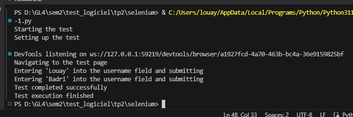
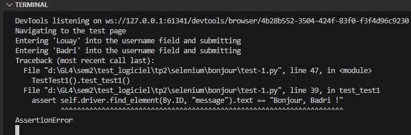
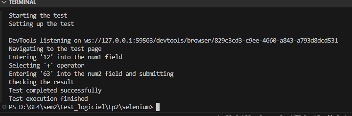
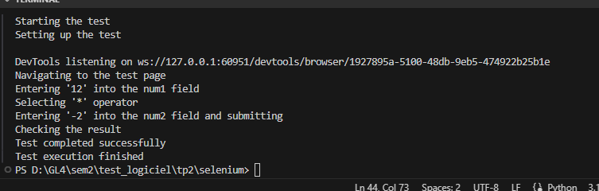
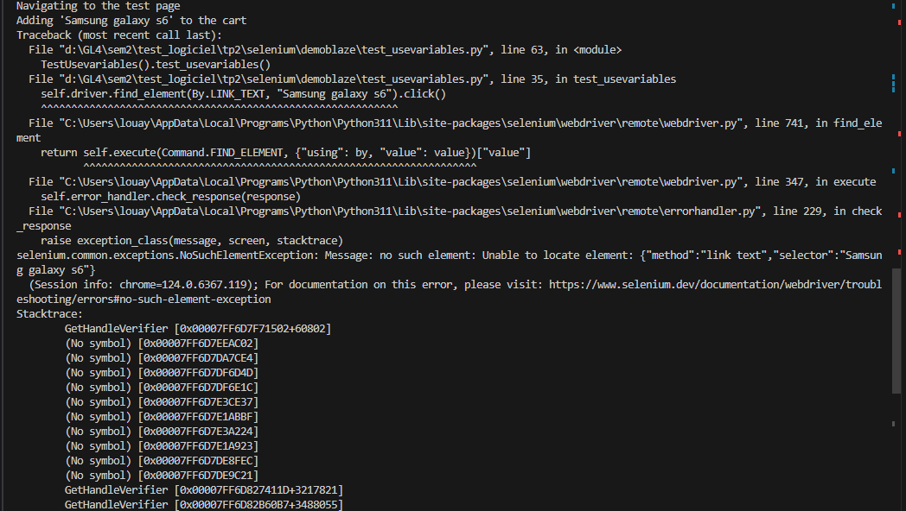
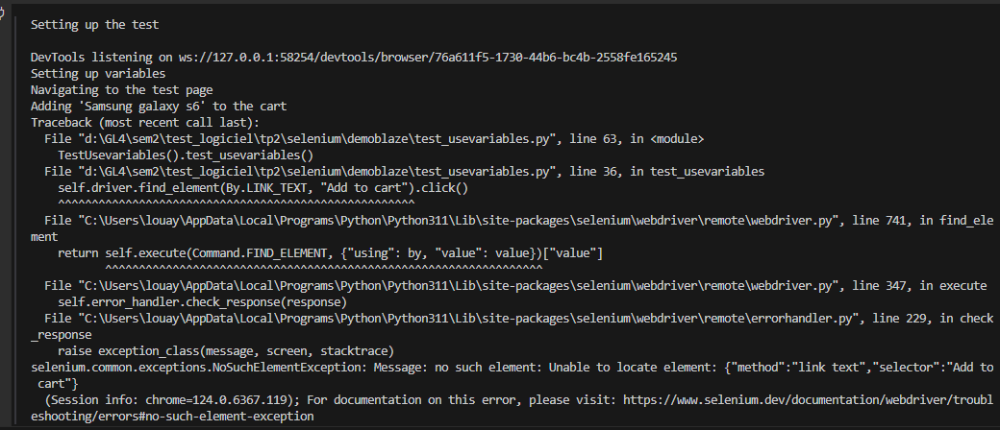

## Navigation
The web browser used is Chrome/Edge.

## Selenium IDE Configuration
Please note that the exported JavaScript code from the Selenium IDE extension has some configurations missing. We tried to download the dependencies but there is an issue with the Mocha library. We are still trying to figure out a solution to it.

## Installation

To run the tests, you need to install selenium and pytest using pip. Here are the commands:

```pip install selenium```


```pip install pytest```


## Pytest Configuration
+The Pytest file still needs some modifications in order to run properly. Here are the modifications we made:
-  We added some `print` statements to clarify the state of the input. These will be displayed in the console.
- If there is a test error, it will be thrown in the console, making it easier to debug.


## Response Exemple for the Bonjour(Exercice 1)
All Good Case



Error Case


## Response Exemple for the Calculator (Exercice 2)







## Response Exemple for the demoblaze (Exercice 3)




